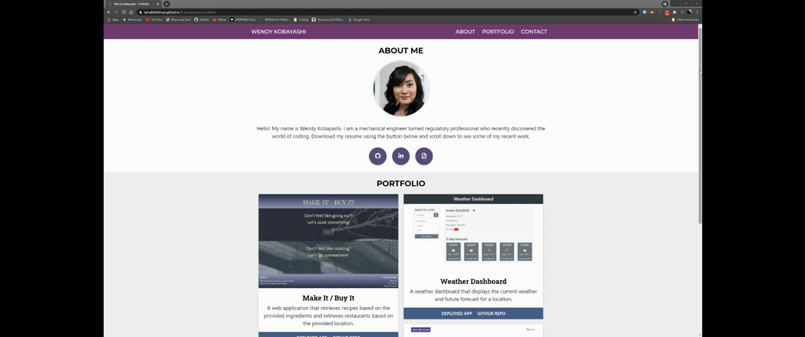

# Professional Portfolio

## Link
https://iamalittleforest.github.io/2-professional-portfolio/

## Languages & Technologies

## Description
Creating a portfolio of work to showcase my skills and projects

### User Story

```
AS AN employer
I WANT to view a potential employee's deployed portfolio of work samples
SO THAT I can review samples of their work and assess whether they're a good candidate for an open position
```

### Acceptance Criteria

Your updated portfolio should:

1. Display your full name, email, and phone number

2. Have links to your GitHub profile and LinkedIn profile

3. Have a link to a downloadable PDF of your resume

4. Display at least 2 examples of student work from either deployed projects or homeworks. For each project, make sure you have the following:

    * Project title

    * Link to the deployed version

    * Link to the GitHub repository

    * Screenshot of the deployed application

5. Have a polished, mobile-responsive user interface.

## Screenshot


## Demo


## License
MIT License

## Contact Information
Wendy Kobayashi (<wykobayashi@gmail.com>)